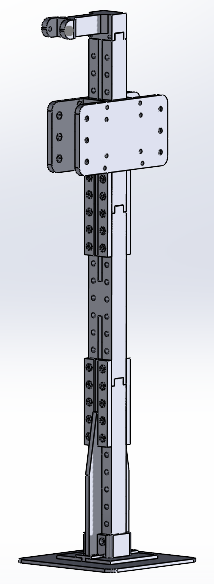

<h1 align="center">lelab-omx</h1>

<p align="center">
  <b>LeLab · LeRobot 워크플로우를 위한 Robotis OMX 양팔 지원</b>
</p>

<div align="center">

[](LICENSE)
[](pyproject.toml)
[](https://github.com/huggingface/lerobot)

**[▶ 시연 영상](https://youtu.be/OeaE-SsWvCA)** · [English README](README.md)

</div>

`lelab-omx`는 브라우저에서 동작하는 LeLab 워크플로우를 **Robotis OMX-AI 양팔 로봇**으로
확장한 프로젝트입니다. 캘리브레이션 · 원격조작 · 데이터 수집 · 학습 · 리플레이 · 추론까지
**코드 작성 없이 웹 UI만으로** 수행할 수 있습니다.

| 원격조작 데이터 수집        | 학습된 정책의 자율 동작         | 에피소드 검수               |
| --------------------------- | ------------------------------- | --------------------------- |
|  |  |  |

---

## 빠른 시작

요구사항: Python 3.12+, [`uv`](https://docs.astral.sh/uv/), Node.js/npm

```bash
git clone https://github.com/avatar196kc/lelab-omx.git
cd lelab-omx

uv sync --extra dev --extra test
npm ci --prefix frontend
npm run build --prefix frontend
uv run lelab --dev
```

백엔드는 `8000` 포트, Vite 개발 서버는 `8080` 포트를 사용합니다.

## 사용 흐름

전 과정이 브라우저에서 이루어집니다. 각 단계는 앱의 화면 하나에 대응합니다.

| #   | 단계              | 하는 일                                                           |
| --- | ----------------- | ----------------------------------------------------------------- |
| 1   | **로봇 설치**     | 리더·팔로워 팔 조립 ([하드웨어 매뉴얼](docs/hardware-manual.pdf)) |
| 2   | **시리얼 포트**   | 팔마다 리더·팔로워 포트 지정                                      |
| 3   | **카메라**        | 좌완 · 우완 · 상부 카메라 지정                                    |
| 4   | **에피소드 설정** | 태스크 이름, 에피소드 수, 길이 설정                               |
| 5   | **원격조작 수집** | 리더 팔을 움직이면 팔로워가 따라가며 기록                         |
| 6   | **에피소드 검수** | 3D로 재생해 확인하고 실패한 것 제외                               |
| 7   | **학습**          | 선별된 데이터셋으로 모방학습 실행                                 |
| 8   | **추론**          | 학습된 정책을 실제 팔에서 구동                                    |

## 하드웨어

- **로봇 팔**: Robotis OMX-AI × 4 (리더 2 + 팔로워 2)
- **제어 보드**: ROBOTIS OpenRB-150 × 4
- **카메라**: USB 카메라 × 3 (좌완 · 우완 · 상부)
- **3D 프린트 부품**: 8종 · 총 14개 —
  [하드웨어 매뉴얼](docs/hardware-manual.pdf) 및 [`hardware/stl/`](hardware/stl/) 참고

<p align="center">
  <br>
  <sub>조립된 카메라 마운트 프레임</sub>
</p>

## 아키텍처

```
웹 UI (React/Vite)
        │  REST + WebSocket
FastAPI 백엔드
        │
LeRobot 드라이버 계층  ──  BimanualRobot / BimanualTeleoperator
        │
OMX-AI 로봇 팔 (OpenRB-150 경유 Dynamixel)
```

수집된 에피소드는 [LeRobotDataset](https://huggingface.co/docs/lerobot) `v3.0`
(`robot_type: bimanual_omx_follower_omx_follower`) 형식으로 저장되어,
LeRobot의 학습·추론 스택에 그대로 연결됩니다.

## 향후 계획

- **시뮬레이션 기반 데모 자동 생성** — Isaac Lab 강화학습으로 시연 데이터를 생성하고
  LeRobotDataset으로 내보내 모방학습에 사용하는 파이프라인. 개발 중이며 현재 베이스에는
  포함되어 있지 않습니다.
- 다양한 매니퓰레이터를 지원하는 하드웨어 추상화 계층 확장

## 팀 — 로봇팔랩

| 팀원                                                        | 기여                                                              |
| ----------------------------------------------------------- | ----------------------------------------------------------------- |
| **채병기** ([@avatar196kc](https://github.com/avatar196kc)) | 프로젝트 리드 · 데이터셋 수집 · 3D 출력 · 하드웨어 조립 및 테스트 |
| **서지현** ([@Luneberry](https://github.com/Luneberry))     | 데이터셋 수집 · 라이선스 정비 · 베이스 이관                       |
| **김주형** ([@runefor](https://github.com/runefor))         | Isaac Lab 파이프라인 구성 · 강화학습 · 코드 리뷰                  |
| **이상직**                                                  | 3D 출력 · 하드웨어 조립 및 테스트 · 데이터셋 수집                 |
| **전지현**                                                  | 데이터셋 수집 · 프로젝트 이론 정리                                |

## 기술 참고 자료

- [LeLab 공식 문서](https://huggingface.co/docs/lerobot/lelab)
- [Hugging Face LeLab](https://github.com/huggingface/leLab)
- [1차 LeLab 저장소](https://github.com/orocapangyo/leLab)
- [1차 설치 안내](https://github.com/orocapangyo/leLab/blob/main/study/install.md)

## 원본 및 라이선스

애플리케이션 베이스는 [`orocapangyo/leLab`](https://github.com/orocapangyo/leLab)의
커밋 [`6fc977e`](https://github.com/orocapangyo/leLab/commit/6fc977e)에서 이관했으며,
이는 Hugging Face LeLab을 기반으로 합니다. 원 저작권 및 Apache-2.0 고지는 보존되어 있습니다.
출처는 [NOTICE](NOTICE), 사용한 오픈소스 구성요소는 [THIRD_PARTY.md](THIRD_PARTY.md)를 참고하십시오.

본 저장소는 [Apache License 2.0](LICENSE)으로 배포됩니다.
