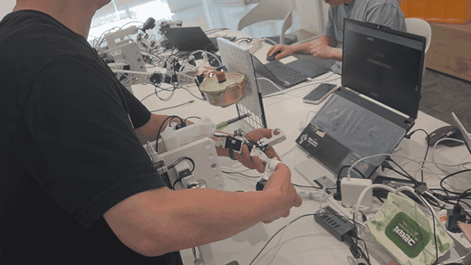
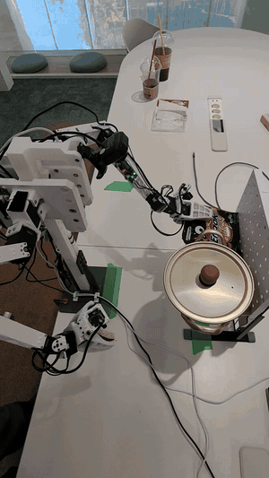
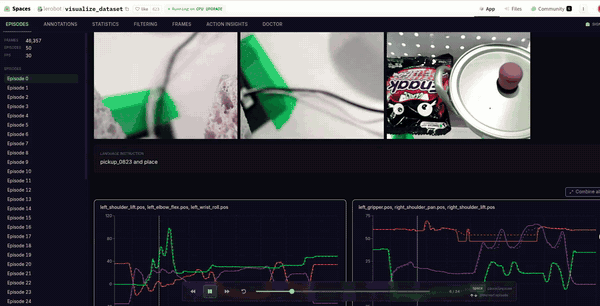

<h1 align="center">lelab-omx</h1>

<p align="center">
  <b>Robotis OMX bimanual support for LeLab and LeRobot workflows.</b>
</p>

<div align="center">

[](LICENSE)
[](pyproject.toml)
[](https://github.com/huggingface/lerobot)

**[▶ Demo video](https://youtu.be/OeaE-SsWvCA)** · [한국어 README](README.ko.md)

</div>

`lelab-omx` extends the browser-based LeLab workflow to **Robotis OMX-AI bimanual
arms**. Calibrate, teleoperate, record, train, replay, and run inference on a
dual-arm setup from a web UI — without writing code.

| Teleoperated data collection | Autonomous rollout | Episode review |
|---|---|---|
|  |  |  |

---

## Quick start

Requirements: Python 3.12+, [`uv`](https://docs.astral.sh/uv/), Node.js/npm.

```bash
git clone https://github.com/avatar196kc/lelab-omx.git
cd lelab-omx

uv sync --extra dev --extra test
npm ci --prefix frontend
npm run build --prefix frontend
uv run lelab --dev
```

Backend runs on port `8000`; the Vite dev server on `8080`.

## Workflow

The whole loop runs in the browser. Each step below maps to a screen in the app.

| # | Step | What you do |
|---|---|---|
| 1 | **Robot setup** | Mount leader and follower arms ([hardware manual](docs/hardware-manual.pdf)) |
| 2 | **Serial ports** | Assign leader/follower ports per arm |
| 3 | **Cameras** | Assign left / right / overhead cameras |
| 4 | **Episode config** | Set task name, episode count, duration |
| 5 | **Teleoperated collection** | Move the leader arms; follower mirrors and records |
| 6 | **Episode review** | Replay episodes in 3D, flag and reject bad takes |
| 7 | **Training** | Launch imitation learning on the recorded dataset |
| 8 | **Inference** | Run the trained policy on the real arms |

## Hardware

- **Arms**: Robotis OMX-AI × 4 (2 leader + 2 follower)
- **Controllers**: ROBOTIS OpenRB-150 × 4
- **Cameras**: 3 × USB (left arm, right arm, overhead)
- **3D printed parts**: 8 designs, 14 pieces total — see the
  [hardware manual](docs/hardware-manual.pdf) and [`hardware/stl/`](hardware/stl/)

## Architecture

```
Web UI (React/Vite)
        │  REST + WebSocket
FastAPI backend
        │
LeRobot driver layer  ──  BimanualRobot / BimanualTeleoperator
        │
OMX-AI arms (Dynamixel over OpenRB-150)
```

Recorded episodes are stored as a [LeRobotDataset](https://huggingface.co/docs/lerobot)
(`v3.0`, `robot_type: bimanual_omx_follower_omx_follower`), so they plug directly
into the LeRobot training and inference stack.

## Roadmap

- **Simulation-based demonstration generation** — an Isaac Lab reinforcement
  learning pipeline that generates demonstrations and exports them as
  LeRobotDataset data for imitation learning. Under development; not part of the
  current baseline.
- Hardware abstraction for additional manipulators.

## Team — 로봇팔랩

| Member | Contributions |
|---|---|
| **채병기** ([@avatar196kc](https://github.com/avatar196kc)) | Project lead · dataset collection · 3D printing · hardware assembly and testing |
| **서지현** ([@Luneberry](https://github.com/Luneberry)) | Dataset collection · license compliance · base migration |
| **김주형** ([@runefor](https://github.com/runefor)) | Isaac Lab pipeline · reinforcement learning · code review |
| **이상직** | 3D printing · hardware assembly and testing · dataset collection |
| **전지현** | Dataset collection · project documentation and theory |

## Technical references

- [LeLab documentation](https://huggingface.co/docs/lerobot/lelab)
- [Hugging Face LeLab](https://github.com/huggingface/leLab)
- [First-stage LeLab repository](https://github.com/orocapangyo/leLab)
- [First-stage installation notes](https://github.com/orocapangyo/leLab/blob/main/study/install.md)

## Upstream and license

The application base was imported from
[`orocapangyo/leLab`](https://github.com/orocapangyo/leLab) at commit
[`6fc977e`](https://github.com/orocapangyo/leLab/commit/6fc977e), which is based
on Hugging Face LeLab. Source copyright and Apache-2.0 notices are retained.
See [NOTICE](NOTICE) for provenance and [THIRD_PARTY.md](THIRD_PARTY.md) for the
open source components used.

This repository is licensed under the [Apache License 2.0](LICENSE).
